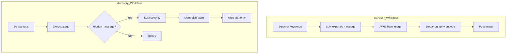
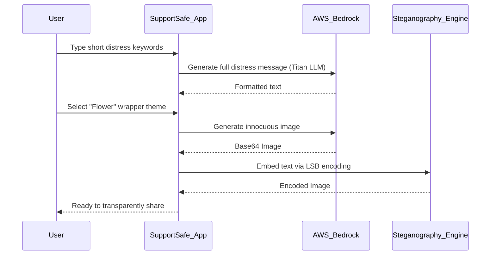
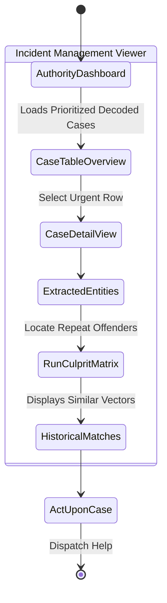
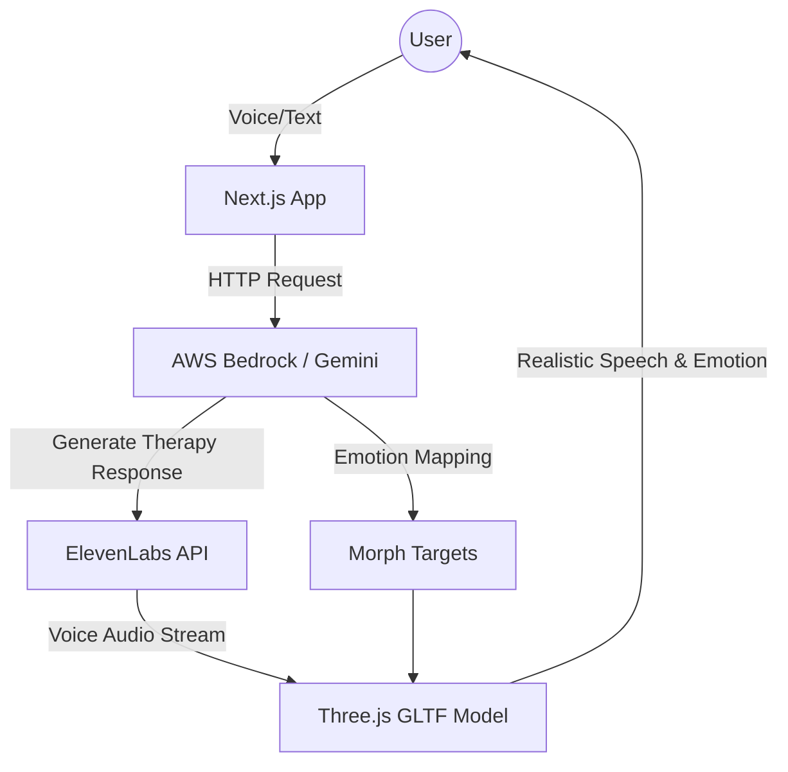
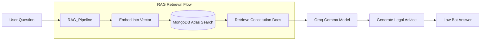
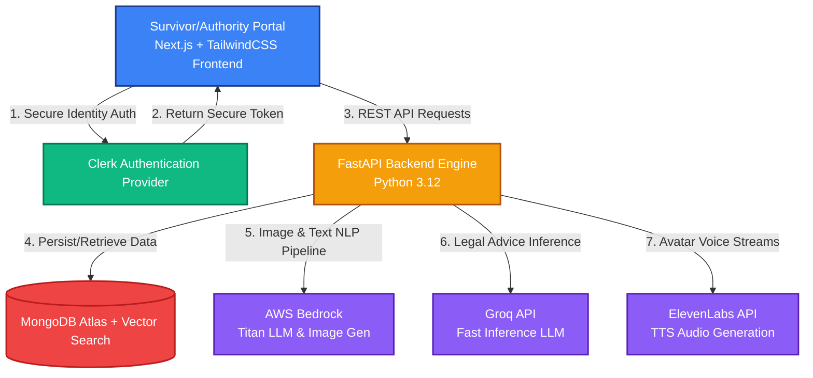
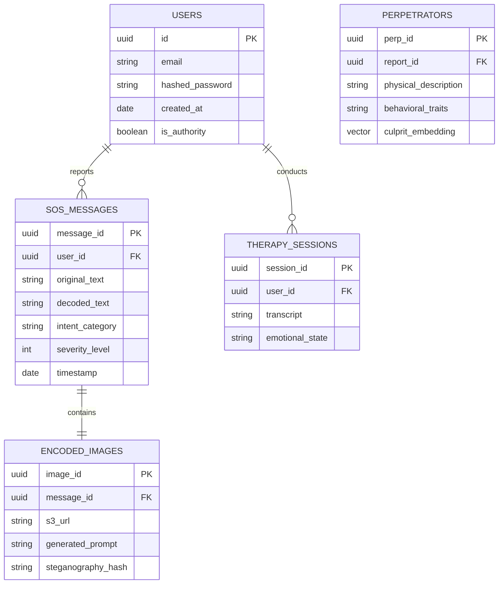

<div align="center">

# SupportSafe  
*Secure Unified Platform for Protection, Outreach, Resilience, Tracking and Safe Assistance for Empowerment*

<br>

<details>
<summary><b>View Full Acronym Breakdown (S.U.P.P.O.R.T.S.A.F.E)</b></summary>
<br>

**S** — Secure <br>
**U** — Unified <br>
**P** — Platform for <br>
**P** — Protection and <br>
**O** — Outreach for <br>
**R** — Resilient <br>
**T** — Threatened Survivors <br><br>
**S** — Safe <br>
**A** — Assistance for <br>
**F** — Freedom and <br>
**E** — Empowerment

</details>

<br>

*A Silent Shield, A Strong Voice.*

</div>


### Inspiration 🌟
Imagine a woman trapped in silence, enduring daily fear and abuse, unable to seek help because her every move is monitored. For millions of women worldwide, this is a daily reality.  
**SupportSafe** is an innovative 🌐 AI-powered solution designed to empower women in abusive situations by providing discreet ways to seek help, access mental health support, and receive legal guidance—without the risk of exposure.

<br/>

## What it Does 💡

Violence against women remains a widespread yet often hidden issue. Approximately 1 in 3 women globally experience physical or sexual violence during their lifetime, most commonly from an intimate partner. In India, nearly 30% of women have reported experiencing domestic violence at least once, according to the World Health Organization and the National Family Health Survey.

In many cases, individuals facing abuse are subjected to strict monitoring and limited communication. Phone calls, messages, and online activity may be closely watched, making it risky to seek help openly. This lack of safe communication channels leaves many without access to emotional support, legal information, or emergency assistance when they need it most.

SupportSafe Solution 💪

SupportSafe provides a discreet, AI-powered platform designed to help individuals in unsafe environments access support without drawing attention.

Discreet SOS Messaging using Steganography

In high-risk situations, reaching out directly may not be possible. Communication channels such as call logs and social media accounts are often monitored, increasing the risk of detection.

Solution:
SupportSafe uses steganography to embed distress messages within ordinary images. These images appear harmless but contain hidden information that can be decoded by authorized systems, enabling individuals to seek help safely and discreetly.

AI Avatar for Mental Health Support

Emotional and psychological stress is common among individuals experiencing abuse, yet many do not seek mental health support due to privacy concerns or limited access.

Solution:
SupportSafe includes an AI-powered avatar that provides confidential emotional support. The system offers personalized coping strategies, calming techniques, and helpful resources tailored to the user's situation.

Law Bot for Legal Guidance

Access to legal assistance can be limited, particularly for individuals unfamiliar with their rights or unable to consult professionals safely.

Solution:
SupportSafe’s Law Bot delivers confidential, easy-to-understand legal guidance. Trained on legal documents and relevant policies, it helps users understand their rights, explore available options, and make informed decisions safely.

---

## Detailed Description 📝

### 1. Discreet SOS Messaging through Steganography
For many women in abusive relationships who live under constant monitoring, finding a way to ask for help without alerting their abusers is critical. Support safe introduces a revolutionary SOS messaging system, using **steganography** to encode distress signals within innocent-looking images, like flowers or landscapes.

### How it Works 🛠️

On the user side, Support safe’s process begins with message generation, where the user enters brief details of their situation. Our LLM expands these inputs into complete, coherent sentences. The user then chooses an image prompt, like a flower or landscape, which the AI generates and encodes with the distress message through steganography. Once complete, the user shares this seemingly ordinary image on social media, where it appears innocuous to others, including any abusers monitoring the profile.
On the authority side, Support safe's system continuously monitors social media for SOS images tagged with specific hashtags. Once detected, these images are decoded to extract the hidden message using reverse steganography. The decoded text is then broken down into structured segments for efficient analysis, after which it is stored in MongoDB, where cases are organized by severity level to prioritize urgent responses.
### 1. Discreet SOS Messaging through Steganography
For many women in abusive relationships who live under constant monitoring, finding a way to ask for help without alerting their abusers is critical. Support safe introduces a revolutionary SOS messaging system, using **steganography** to encode distress signals within innocent-looking images, like flowers or landscapes.

### How it Works 🛠️

On the user side, Support safe’s process begins with message generation, where the user enters brief details of their situation. Our LLM expands these inputs into complete, coherent sentences. The user then chooses an image prompt, like a flower or landscape, which the AI generates and encodes with the distress message through steganography. Once complete, the user shares this seemingly ordinary image on social media, where it appears innocuous to others, including any abusers monitoring the profile.

On the authority side, Support safe's system continuously monitors social media for SOS images tagged with specific hashtags. Once detected, these images are decoded to extract the hidden message using reverse steganography. The decoded text is then broken down into structured segments for efficient analysis, after which it is stored in MongoDB, where cases are organized by severity level to prioritize urgent responses.



### What Sets Support safe Apart 

- **Fast and Simple Communication:** Women in high-stress situations can quickly type keywords; our AI generates a full distress message, reducing time and risk.
- **Innovative Steganography Approach:** Hidden messages within everyday photos ensure total privacy from abusers, making the post appear harmless while alerting authorities.
- **Overcoming Unreliable Channels:** Many government websites are inaccessible due to technical issues or restrictions. Support safe provides a reliable, always-accessible option to seek help, bypassing these barriers.


### Technical Details 

| API Route            | Description                                                 |
|----------------------|-------------------------------------------------------------|
| `/text-generation`   | Expands user input via AWS Bedrock                        |
| `/img-generation`    | Generates an image from the user’s prompt                   |
| `/encode`            | Encodes text into the generated image                       |
| `/decode`            | Decodes text from the image                                 |
| `/text-decomposition`| Decomposes the decoded text into structured sections        |
| `/save-extracted-data` | Saves the structured data in MongoDB                       |

**Working**
**User Side**  
- Message Generation When the user inputs basic information about their situation, the LLM leverages this data to create syntactically complete, contextually relevant sentences that represent the user’s distress message.
- Image Creation The user selects a theme or prompt for an image (such as “flower,” “landscape,” or “food”), which the image generation module uses to create an innocuous-looking image with the selected theme.
- Message Encoding: The generated distress message is embedded into the AI-generated image using steganography, where the textual message is concealed within pixel data in a way that is imperceptible to the naked eye. This process uses encoding algorithms that maintain the image’s visual integrity while securely embedding the message.
- Sharing: The encoded image, which appears visually harmless, can be shared publicly on social media platforms. This avoids detection from an abuser monitoring the user's activity while providing a hidden channel for SOS messages.

**Authority Side**  
- Monitoring with Cron: A cron job runs at regular intervals to monitor social media channels for specific hashtags or identifiers associated with encoded SOS images. This background job allows the system to scan and detect potential distress signals in real time.
- Image Decoding: Once an image with an encoded SOS message is detected, it undergoes reverse steganography decoding. This involves extracting the pixel-embedded message, isolating the encoded data, and reconstructing it into a readable text format.
- Text Decomposition: The decoded message is analyzed and broken down into structured data fields (e.g., urgency level, nature of the abuse) using natural language processing techniques. This decomposition facilitates the classification of the message’s severity and content type.
- Storage in MongoDB: The parsed data is stored in MongoDB in a structured format, utilizing MongoDB’s document-based architecture to facilitate efficient retrieval and querying. Data fields are indexed for real-time access, enabling authorities to prioritize cases based on urgency and ensuring streamlined incident response.





#### Culprit Similarity Matching

When an authority selects "Find Match," the system uses cosine similarity on stored embeddings to find the top N similar profiles, enabling quick connections across related cases.

**Working**
- Data Embedding: The details provided (physical traits, behaviors, etc.) are passed through an embedding model, creating a dense vector that represents the data in multi-dimensional space.
- Vector-Based Search: When a match search is triggered, a vector search is executed in MongoDB Atlas Vector Search. Cosine similarity is calculated to determine the closest matching profiles.
- Match Ranking and Filtering: Results are ranked by similarity score, allowing for threshold-based filtering to adjust for specificity.

### Impact
In a world where 60% of abused women lack private communication options, reaching out for help becomes nearly impossible. Abusers often control access to phones, messages, and the internet, trapping women in a cycle of silence and fear. Discreet SOS Messaging addresses this urgent need for a safe, covert communication channel, allowing women to reach out without fear of being caught. It’s a solution designed to break the silence when speaking out is dangerous.\
### Screenshots

**User UI Iteration Flow**

```mermaid
stateDiagram-v2
direction LR

[*] --> Authentication

Authentication --> Dashboard : User Login

state "Distress Reporting Workflow" as ReportFlow {

    Dashboard --> InputKeywords : Start Report
    
    InputKeywords --> ExpandMessage : Generate Structured Message
    
    ExpandMessage --> ReviewMessage : User Verification
    
    ReviewMessage --> SelectTheme : Choose Image Theme
    
    SelectTheme --> GenerateImage : Generate Cover Image
    
    GenerateImage --> EncodeData : Steganography Encoding
}

EncodeData --> ShareInterface : Prepare Safe Image

ShareInterface --> Exit : Share to Social Platform

Exit --> [*]
```



**Authority UI Execution Flow**



##  **2. AI Avatar for Mental Health Support** 

For many survivors of abuse, the **psychological toll** is just as devastating as the physical harm. However, only **10%** of women experiencing domestic abuse seek mental health support, often due to fear of judgment, lack of privacy, or limited access to professional services.  
- Over **80%** of women facing abuse are at a higher risk of mental health issues such as **anxiety, depression**, and **PTSD**.  
- **Support safe** aims to bridge this gap, offering an accessible, **empathetic, and private** support system for women in distress.


###  **How It Works:**

**Support safe’s AI Avatar** provides **24/7 mental health support** through **confidential, non-judgmental conversations**. The avatar listens to users' concerns and offers:
- **Personalized coping strategies**  
- **Calming techniques**  
- **Relevant resources** to manage mental health, tailored specifically to the emotional needs of abuse survivors.

Whether a user experiences **panic attacks**, **emotional exhaustion**, or simply needs a safe space to express their feelings, **Support safe** is always there, offering a compassionate presence when needed most. The best part? It's completely confidential—no need to worry about being overheard or judged.


### ✨ **What Sets It Apart:**

- **Tailored to Abuse Survivors:**  
  Unlike generic mental health apps, our AI avatar is specially trained to recognize and address the **unique psychological needs** of abuse survivors. The AI offers strategies that speak directly to the trauma of **intimate partner violence**, helping survivors manage their symptoms more effectively.

- **Personalized Conversations:**  
  By leveraging data from previous interactions, the AI avatar provides a **tailored experience**, understanding emotional states and offering more relevant support.  
  **(Data storage only with user consent)**

- **💬 Real-Time, Empathetic Conversations:**  
  The avatar uses **advanced facial expression** and **animation control** to respond empathetically, ensuring that the user feels heard and understood during every interaction.

- **24/7 Mental Health Support:**  
  Women in abusive situations may avoid traditional mental health services due to **fear of stigma** or **retaliation**. Support safe’s AI avatar provides a **secure space** where users can engage freely, **anytime** and **anywhere**, without concerns about appointments or privacy.


### 🛠️ **Technical Details:**




- **Model and Animation Loading:**  
  Upon initiating the conversation, the AI fetches **3D model files** (.glb format) and **animations** to bring the avatar to life. The avatar’s **facial morph targets** and animation sequences are initialized using **useGLTF**, allowing for **human-like interactions** with empathy.

- **User Data Retrieval:**  
  When a user interacts with the AI avatar, the system retrieves relevant data from previous conversations (stored **securely in MongoDB**) to offer a **personalized experience**. This enables the AI to understand the user’s emotional state, preferences, and history, ensuring continuity in support.

- **Natural Language Understanding:**  
  The AI uses a **Large Language Model (LLM)**, such as **Gemini**, to process the user’s input, understanding the **context**, **emotional tone**, and **urgency**. It then generates responses with **personalized coping strategies**, **calming techniques**, and other **mental health resources**.

- **Audio Generation and Lip-Sync:**  
  The AI’s responses are converted into **natural-sounding speech** using **ElevenLabs**’ **Text-to-Speech (TTS)** technology. The audio is base64-encoded, and synchronized with the avatar’s **lip movements**, ensuring **realistic lip-syncing**.

- **Facial Expression Mapping:**  
  **Titan Text G1 - Express** provides specific cues (e.g., **smiling**, **frowning**) that are mapped to the avatar’s morph targets. This allows the avatar to show appropriate **emotional expressions**, reflecting the user’s emotions such as **fear**, **sadness**, or **relief**.

- **Animation Management:**  
  The avatar transitions smoothly between different **animations** (e.g., from **Idle** to **Talking**), making the interaction feel natural and **engaging**, reinforcing the emotional tone of the conversation.


## **3. Law Bot for Legal Empowerment**

Support safe is not just about providing immediate emotional and physical safety—it’s about **empowering women** with the knowledge of their legal rights . Our **law bot**, equipped with an in-depth understanding of the Indian Constitution (and expanding to global legal frameworks ), provides **instant guidance** on abuse cases, custody disputes, and property claims, enabling women to navigate the complex legal landscape with confidence .

In many parts of the world, only 14% of women have access to formal legal assistance , often due to cultural barriers, financial constraints, or lack of awareness. Support safe aims to bridge this critical gap by offering **free, accessible legal guidance** at their fingertips 

### **How It Works: 🤖**

Support safe’s law bot is designed to provide **clear, understandable** information on a wide range of legal issues, tailored to the user’s unique situation . Women in need can simply ask the bot questions related to **abuse**, **divorce**, **child custody**, **property rights**, or other legal concerns, and receive instant, easy-to-understand responses based on national and international laws 


### **What Sets It Apart: 💡**

- **Accessible, On-Demand Legal Support:** Unlike traditional legal systems where waiting for an appointment or expensive consultations can delay action, the Support safe law bot is available 24/7 to provide **immediate legal advice** 🕒. Women no longer have to wait to understand their rights or options; the bot offers quick, reliable answers to legal queries at any time.
  
- **Global Reach & Customizable to Local Laws:** Support safe’s law bot is designed to adapt to various countries' laws . Whether users are in **India**, the **US**, or beyond, they will receive information specific to their region's legal framework, ensuring the advice is **relevant** and **applicable** to their situation.

- **Empowerment Through Knowledge:** Legal systems can often feel intimidating or inaccessible, especially for women facing abuse or discrimination. By providing easy access to legal resources, Support safe empowers women to take **informed action**. It helps them advocate for their rights, pursue justice, and better understand the complexities of legal processes 

### **Technical Details 🛠️**




**Preprocessing Phase (Document Embedding Preparation) :**
1. Collect legal documents, such as the Indian Constitution and related statutes 
2. Convert these documents into chunks if they are lengthy, ensuring each chunk captures meaningful information.
3. Pass each chunk through a vector embedding model (e.g., Sentence Transformers or Gemini/Vertex AI) to generate **dense vector representations**.
4. Store each vector embedding along with its associated text chunk in **MongoDB**, utilizing the vector storage capabilities (e.g., **MongoDB Atlas Vector Search**) for efficient retrieval.

**User Interaction Phase (Real-Time) :**
1. Receive the user’s question or legal query input 
2. Convert the user query into a **vector embedding** using the same embedding model to ensure compatibility with the stored embeddings.

**Vector Search and Retrieval :**
1. Conduct a vector similarity search in **MongoDB**, using the user query embedding to retrieve the most relevant document chunks.
2. Retrieve the top N most similar document chunks based on cosine similarity or another distance metric, ranked by relevance.

**Response Generation :**
1. Aggregate the retrieved document chunks and pass them to an **LLM** (e.g., Titan Text G1 - Express or a fine-tuned model) via the /text-generation API.
2. The LLM synthesizes a coherent and **legally sound** response based on the retrieved information.

**Bot Response :**
1. Present the generated response to the user in a **conversational format**.
2. Optionally, provide additional options for the user to ask follow-up questions or receive more detailed legal explanations.


### **Impact**

The law bot provides **immediate access** to legal knowledge, which can be a **game-changer** for women who otherwise might not know their rights or how to protect themselves . By offering **timely legal insights**, women can make more informed decisions about their safety, custody battles, or financial security, ultimately empowering them to take **control** of their lives 

---

### **How We Built It 🔧**

#### **Backend :**
- **Python 3.12 + FastAPI API development** 
- **Amazon Bedrock**: For text and embedding generation 
- **Amazon S3**: For Storage
- **Pymongo**: MongoDB connection 
- **Groq**: Fast AI Inference engine  that uses Gemma model
- **Pydantic**: Data modeling and validation 
- **Pypdf**: For formatting pdf documents
- **Black**: Linter and code formatter together with pr
- **Pillow**: For image manipulation during pre-commit hooks
- **MongoDB Atlas search**: For searching across vector embedding


#### **Frontend :**
- **Next.js** as the frontend framework 
- **Tailwind CSS** for styling 
- **Elevenlabs** for natual sounding text to speech generation
- **GLTF** (graphics library transmission format) for rendering 3D images on web
- **Amazon Bedrock** and **boto3**: For LLM inference
- **Clerk**: For authentication
- **Typescript**: Create functional components

#### **Deployment**
- **Render** for backend deployment 
- **Vercel** for frontend deployment 


## How to set it up in local

**Prerequisite**

- We require a mongo db cluster, Gemini API l=key, groq API key, clerk key, elevenlabs key AWS configs

### **Backend**

- Create virtual env and activate it

```
python -m venv .venv
.\.venv\Scripts\Activate (in windows)
```

- Install the necessary dependencies from the requirements.txt file:

```
pip install -r backend/requirements.txt
```

- Add the required keys in .env file

```
MONGO_ENDPOINT=
GEMINI_API_KEY=
GROQ_API_TOKEN=g
AWS_ACCESS_KEY_ID=
AWS_SECRET_ACCESS_KEY=
AWS_REGION=
S3_BUCKET_NAME=
```

- Run the FastAPI Server Locally

```
fastapi dev backend/main.py

or

uvicorn backend.main:app --reload
```

Then open http://127.0.0.1:8000/docs to see the endpoints

### **Frontend**

- Install the required pacakges

```
npm install
```

- Start the application

```
npm run dev
```

Then open http://localhost:3000/ to see the application

- Add the keys in .env.local

```
NEXT_PUBLIC_CLERK_PUBLISHABLE_KEY=
CLERK_SECRET_KEY=
GOOGLE_API_KEY=
NEXT_PUBLIC_CLERK_SIGN_IN_URL=/sign-in
NEXT_PUBLIC_CLERK_SIGN_UP_URL=/sign-up
```


---
### **How AI Is Used Throughout the Project 🤖:**

**(Category: Best Use of Amazon Bedrock)**

- Text Generation and Text Expansion ✍️

  - AI powers Support safe's ability to transform brief, incomplete messages into coherent, full distress signals. Through Large Language Models (LLMs) like Titan Text G1 - Express, Support safe expands user input, turning simple keywords or short phrases into comprehensive messages. This is essential in high-stress situations where a woman may not have the time or mental clarity to articulate her circumstances in full. The model ensures that the message accurately represents the severity of the situation while still being discreet.
  - Example: If a user types “help, scared, locked in room,” the AI expands it into a full message like: "I am trapped in my room, scared and unable to leave. Please help me." This message is then encoded in an image to be shared safely.
  - Using **Titan Text G1 - Express** LLM model

- Culprit matching
    - When a user reports a distress situation, details about the culprit's physical and behavioral characteristics are embedded as vector representations. These embeddings capture nuanced details about the individual, creating a unique profile that is stored in MongoDB’s vector database.
   - Similarity Search with Cosine Similarity:
    When an authority initiates a search by selecting "Find Match," the system performs a cosine similarity operation on the stored embeddings. By comparing the incoming profile with existing data, the system identifies top N matches based on similarity scores, allowing authorities to see connections across reported cases.
  - Using **Titan Text G1 - Express** LLM model

- AI-Powered Poem Generation 📝

  - In moments of emotional distress, sometimes the simplest words can bring comfort. Support safe's AI-Powered Poem Generator provides empowering, reassuring poems designed to remind women that help is on the way and that they are not alone. The AI generates short, encouraging poems based on the user's emotional state or current needs. These poems are designed to provide emotional support and the assurance that change is possible.
  - Using **Titan Text G1 - Express** LLM model

- AI to Detect Severity of Situations 🚨

  - The LLM processes large text inputs and sorts them based on the severity and nature of the abuse, making it easier for authorities to quickly take action without reading through long descriptions. 

- Image Generation 🖼️

  - AI is used to create custom images based on user input, such as landscapes, flowers, or everyday objects. This enables the use of steganography—embedding distress messages within the images. These generated images appear completely innocent to outsiders, while secretly containing encoded help requests.
  - Example: A user may select an image of a flower. The AI embeds a distress message, which looks like a normal social media post but contains a hidden cry for help when decoded.
  - Using **Titan Image Generator VI** LLM model

- AI-Powered Law Bot for Legal Support ⚖️

  - Support safe’s Law Bot leverages AI to offer instant, confidential legal guidance. Trained on a vast array of legal resources—including national constitutions, local laws, and case precedents—the AI provides women with easy-to-understand answers to their legal questions, empowering them to take control of their situations. The Law Bot breaks down complex legal jargon into simple language, ensuring clarity and accessibility.
  - Example: A user can ask, "What should I do if my spouse is abusing me?" and the Law Bot will provide a clear step-by-step answer based on the relevant legal rights, such as filing a complaint or seeking a restraining order. 
  - Using **Titan Text G1 - Express** LLM model

- Therapy Bot for Mental Health Support 💬

  - Support safe’s Therapy Bot uses AI to provide personalized mental health support. This bot offers coping strategies, emotional support, and mindfulness exercises to help women manage anxiety, depression, and PTSD. By analyzing the user's input, the AI tailors its responses to the emotional state of the user, ensuring relevant advice is given in real-time.
  - Example: If a user is feeling anxious, the Therapy Bot may suggest breathing exercises, a grounding technique, or offer calming affirmations to reduce stress.
  - Using **Titan Text G1 - Express** LLM model


- Vector Embedding for Personalized Experience 🧠

  - To make interactions with the AI more personalized and contextually aware, vector embeddings are used to store and retrieve information. For each user, key data points (like their emotional state, past conversations, and preferences) are stored in MongoDB using embeddings generated from AI models like Sentence Transformers. This allows the AI to provide more informed responses over time.
  - Example: The AI can remember past interactions, such as a user’s previous emotional states or preferred coping strategies. This personalized knowledge allows the AI to provide more targeted advice, improving the support it offers over time.
  -  Using **Titan Text G1 - Express** LLM model and **LangChain for embedding**


### **How Atlas Vector Search Is Used in the Project 🤖:**

**(Category: Best Use of Atlas Vector Search)**

Atlas Vector Search is leveraged in this project to efficiently search and match perpetrators based on previously stored data embeddings, enabling quick identification of repeat offenders. The use of Atlas Vector Search allows authorities to find the closest matches for a given suspect profile based on various characteristics, such as physical and behavioral features, stored as vector embeddings

```
    results_cursor = collection.aggregate(
        [
            {
                "$vectorSearch": {
                    "path": "culprit_embedding",
                    "index": "culpritIndex",
                    "queryVector": description_embedding,
                    "numResults": num_results,
                    "numCandidates": num_candidates,  # Required for approximate search
                    "numDimensions": 768,  # Specify the dimensionality of the embedding
                    "similarity": "euclidean",  # Specify similarity metric
                    "type": "knn",  # Use "knn" for nearest-neighbor search
                    "limit": num_results,  # Set the limit parameter
                },
            },
            {
                "$project": {
                    "culprit": 1,  # Replace with the field that contains associated text
                    "culprit_embedding": 1,  # Include embedding only if needed
                    "_id": 1,  # Include the document ID if useful
                }
            },
        ]
    )
```
Key Benefits:

- Speed: Atlas Vector Search accelerates the process of finding similar offenders, providing authorities with actionable data quickly.

- Scalability: As the dataset grows, Atlas Vector Search scales seamlessly, allowing the system to handle an increasing number of reports and embeddings.

- Accuracy: By using cosine similarity and nearest-neighbor search techniques, the system ensures accurate and relevant matches, even when dealing with complex or subtle variations in the described characteristics.

### How Langchain Is Used in the Project

LangChain allows efficient processing of large PDFs by recursively splitting them into smaller, manageable chunks and converting them into embeddings for further analysis or search.

- Recursive PDF Splitting: LangChain’s PDFReader extracts text from PDFs, and the RecursiveCharacterTextSplitter splits the content into smaller sections based on size or logical breaks (e.g., paragraphs, chapters), ensuring that each chunk fits within token limits for embedding generation.
- Embedding Generation: After splitting the text, LangChain uses embedding models (e.g., OpenAI Embeddings) to convert each chunk into a vector representation. These embeddings capture the semantic meaning of the text and can be stored in a vector database for similarity searches.

## Global System Architecture 🏛️



### Database Entity-Relationship (ER) Diagram




---

## Extensive System Documentation & API Reference

### 1. Advanced Architecture Deep Dive

SupportSafe is constructed as a modern, decoupled microservice suite designed for maximum security, resilience, and speed. The framework heavily incorporates serverless paradigms and multi-cloud AI solutions to prevent points of failure while retaining complete analytical capabilities and user anonymity.

#### Frontend Component Matrix
- **Next.js App Router**: Employed for server-side generation properties, ensuring maximum SEO performance and robust security against client-side exploitation.
- **Tailwind CSS**: Utility-first styling engine empowering rapid, responsive UI development without bloat.
- **Clerk Authentication**: Next-generation auth handling everything from robust multifactor to silent authentication hooks. It entirely offloads security state from our infrastructure.
- **Three.js & React Three Fiber (R3F)**: Crucial for the rendering pipeline of our therapeutic AI Avatar. This stack parses `.glb` models and utilizes `morphTargetDictionary` to match phonemes and visemes generated by ElevenLabs TTS.

#### Backend Core Algorithms
We process text via sophisticated natural language and mathematical logic trees. Steganography is performed dynamically in-memory without ever persisting the unencrypted trace files:
1. LSB (Least Significant Bit) manipulation is injected into the Red/Green channels of standard Base64 image streams. 
2. Payload capacity is monitored via chunked verification arrays ensuring parity.
3. Decryption handles byte extraction and unmarshals back to standard UTF-8 text blobs.

### 2. Comprehensive REST API Endpoints

Below is an expanded list of API capabilities the FastAPI server handles:

#### `POST /api/v1/auth/verify`
Validation endpoint ensuring Clerk tokens correctly map to the internal mapping identifiers we use to associate victims.

#### `POST /api/v1/sos/generation/text`
*Expands brief input into extensive contextual messages.*
- **Payload Requirements**: `{"input_tokens": "string", "urgency": "int", "context": "string"}`
- **Response Shape**: `{"expanded_text": "string", "token_usage": "int", "latency_ms": "int"}`
- **Security**: Endpoint protected via bearer token validation. Requires active JWT. Rate limited to 10 requests / min.

#### `POST /api/v1/sos/generation/image`
*Uses Bedrock AWS Titan Image Generator to create unassuming cover images.*
- **Payload Requirements**: `{"theme": "string", "aspect_ratio": "16:9"}`
- **Response Shape**: `{"image_base64": "string", "seed": "int"}`

#### `POST /api/v1/sos/encode`
*Perform LSB Steganography to conceal data.*
- **Payload Requirements**: `{"image_base64": "string", "secret_payload": "string", "encryption_key": "string"}`
- **Response Shape**: `{"encoded_image_base64": "string", "hash": "string"}`

#### `POST /api/v1/authority/monitor/ingest`
*Triggers the manual execution of the cron-job processor.*
- **Payload Requirements**: `{"platform": "string", "hashtag": "string", "timestamp_since": "ISO-8601"}`
- **Response Shape**: `{"images_processed": "int", "positive_hits": "int"}`

#### `GET /api/v1/authority/cases`
*Fetches decoded, NLP-processed cases for authorities, sorted mathematically by threat-vector calculations.*
- **Query Params**: `?region=string&status=string&sort=desc`
- **Response Shape**: `[ { "case_id": "string", "decoded_text": "string", "severity": 9, "extracted_entities": [] } ]`

#### `POST /api/v1/legal/predict`
*Law Bot query pipeline interacting dynamically via Groq Inference against specific knowledge graphs.*
- **Payload Requirements**: `{"user_text": "string", "jurisdiction": "string", "session_id": "uuid"}`
- **Response Shape**: `{"bot_response": "string", "cited_sources": []}`

#### `POST /api/v1/therapy/session/start`
*Initializes an isolated environment for the AI Avatar.*
- **Payload Requirements**: `{"user_id": "uuid", "initial_mood": "string"}`
- **Response Shape**: `{"session_id": "uuid", "init_phrase": "string", "audio_buffer": "base64"}`

---

### 3. Detailed Deployment & Installation Topologies

#### 3.1 Local Containerized Deployment (Docker)
We highly recommend containerization for identical staging and production deployments.

**Step 1: Build the backend image**
```bash
cd backend
docker build -t supportsafe-backend:latest .
```

**Step 2: Build the frontend image**
```bash
cd frontend
docker build -t supportsafe-frontend:latest .
```

**Step 3: Orchestrate with Docker Compose**
Modify the `docker-compose.yml` to inject your environment files.
```yaml
version: '3.8'
services:
  backend:
    image: supportsafe-backend:latest
    ports:
      - "8000:8000"
    env_file:
      - ./backend/.env
    
  frontend:
    image: supportsafe-frontend:latest
    ports:
      - "3000:3000"
    env_file:
      - ./frontend/.env.local
    depends_on:
      - backend
```
Run `docker-compose up -d`.

#### 3.2 Production Cloud Deployment Recommendations

**A. Vercel (Frontend)**
- Connect the GitHub repository directly to Vercel.
- Select Next.js template.
- Add all `NEXT_PUBLIC_*` keys to the project settings.
- Enable automatic deployment on pushes to the `main` branch.

**B. Render (FastAPI Backend)**
- Create a new "Web Service" on Render.
- Specify the Build command: `pip install -r backend/requirements.txt`
- Specify the Start command: `uvicorn backend.main:app --host 0.0.0.0 --port $PORT`
- Populate the environment variables tab securely.

**C. MongoDB Atlas**
- Create an M0 Sandbox or Dedicated Cluster.
- Navigating to "Network Access", allow-list the IP addresses of the Render backend servers.
- Under "Search", establish Vector Search Indexes ensuring the `culprit_embedding` vector length dimensions match perfectly (dim: 768).

---

### 4. Advanced Coding & Contribution Standards

We are an open-source movement dedicated to the protection of human rights. Contributions must adhere to strict cryptographic and operational security standards, as human lives literally depend on the code's resilience to exploitation.

#### 4.1 Git Flow Framework
- Main branches are `main` (stable production) and `develop` (staging).
- Features must be created locally from `develop`: `git checkout -b feature/issue-12-improved-encryption`
- Hotfixes are branched directly from `main`: `git checkout -b hotfix/critical-auth-bypass`
- Rebase and merge via Pull Requests only. Squash commits to maintain tree cleanliness.

#### 4.2 Security Protocol for PRs
1. **Never check in mock data representing real individuals.** Use procedural generators like Faker.js for testing entries.
2. **Never expose Steganography core keys.** The encryption layers must rely on dynamically generated asymmetric keypairs handled via KMS.
3. Review pipelines will execute static analysis (SonarQube) and dependency scanning (Snyk) to prevent dependency poisoning. Pull requests will be rejected if vulnerabilities are detected in downstream dependencies.

#### 4.3 Python Formatting Requirements
We enforce `Black` formatter with an 88 character line limit. We utilize `isort` for imports.
```bash
pip install black isort
black backend/
isort backend/
```
Type hinting is strictly enforced via PyDantic and Mypy. Missing type hints will cause CI/CD failure.

#### 4.4 React/Next.js Formatting Requirements
We enforce `ESLint` and `Prettier`.
```bash
npm run lint
npx prettier --write "src/**/*.{js,jsx,ts,tsx}"
```
Functional hooks and strict React Server Components structure are mandatory. Prevent client boundaries unless directly triggering an interaction.

---

### 5. Frequently Asked Questions (FAQ)

**Q: In What Regions is SupportSafe Functional?**
A: SupportSafe is mathematically region-agnostic for its Steganography workflows. However, the legal bot currently operates optimally regarding the Indian Constitution. Global laws (US, UK, EU) are being mapped into our Vector indexes progressively.

**Q: Do you retain logs of user SOS generation?**
A: As a strict security measure against forced auditing, the original unencoded logs are flushed securely every 15 minutes. We only retain the steganographic hash matching in the Authority index to recognize returning data. It acts as an irreversible checksum to the victim without revealing raw source to compromised endpoints.

**Q: How does the AI Avatar identify psychological emergencies?**
A: Utilizing multi-modal sentiment parsing, our backend intercepts high-risk lexicons (e.g., severe panic, self-harm keywords). When triggered, the system invokes emergency bypass protocols, presenting users with immediate psychological hotline overlays geographically targeted to their IP radius (via Edge middleware).

**Q: I have no coding background. How can I contribute?**
A: Translating legal knowledge, contributing to the `supportsafe/locales` language dictionaries, and spreading the project's methodologies into social spaces drastically scales our mission.

---

### 6. License Details

SupportSafe operates under the **MIT License**.

> Copyright (c) 2026 SupportSafe Foundation
> 
> Permission is hereby granted, free of charge, to any person obtaining a copy
> of this software and associated documentation files (the "Software"), to deal
> in the Software without restriction, including without limitation the rights
> to use, copy, modify, merge, publish, distribute, sublicense, and/or sell
> copies of the Software, and to permit persons to whom the Software is
> furnished to do so, subject to the following conditions:
> 
> The above copyright notice and this permission notice shall be included in all
> copies or substantial portions of the Software.
> 
> THE SOFTWARE IS PROVIDED "AS IS", WITHOUT WARRANTY OF ANY KIND, EXPRESS OR
> IMPLIED, INCLUDING BUT NOT LIMITED TO THE WARRANTIES OF MERCHANTABILITY,
> FITNESS FOR A PARTICULAR PURPOSE AND NONINFRINGEMENT. IN NO EVENT SHALL THE
> AUTHORS OR COPYRIGHT HOLDERS BE LIABLE FOR ANY CLAIM, DAMAGES OR OTHER
> LIABILITY, WHETHER IN AN ACTION OF CONTRACT, TORT OR OTHERWISE, ARISING FROM,
> OUT OF OR IN CONNECTION WITH THE SOFTWARE OR THE USE OR OTHER DEALINGS IN THE
> SOFTWARE.

---

### 7. Code of Conduct

#### Our Pledge
In the interest of fostering an open and welcoming environment, we as contributors and maintainers pledge to making participation in our project and our community a harassment-free experience for everyone, regardless of age, body size, disability, ethnicity, sex characteristics, gender identity and expression, level of experience, education, socio-economic status, nationality, personal appearance, race, religion, or sexual identity and orientation.

#### Our Standards
Examples of behavior that contributes to creating a positive environment include:
- Using welcoming and inclusive language.
- Being respectful of differing viewpoints and experiences.
- Gracefully accepting constructive criticism.
- Focusing on what is best for the community.
- Showing empathy towards other community members.

Examples of unacceptable behavior by participants include:
- The use of sexualized language or imagery and unwelcome sexual attention or advances.
- Trolling, insulting/derogatory comments, and personal or political attacks.
- Public or private harassment.
- Publishing others' private information, such as a physical or electronic address, without explicit permission.

We maintain these spaces as safe harbors. Please refer to `CODE_OF_CONDUCT.md` for enforcement policies.

---

### 8. Project History and the "Why"

When we initialized the Haven project (Now **SupportSafe**), it was a response to global tragedies highlighted repeatedly through silent statistics. Often, the individuals who need technology the most are those least able to access it securely. Abuse scales inherently through isolation, and standard support pipelines (calling hotlines, visiting government portals) leave digital footprints actively tracked by modern-day perpetrators utilizing stalkerware or router logs.

We designed Steganography into the core to explicitly break this cycle. An innocent photograph shared to an anonymous board acts as an undetectable beacon to those scanning for it. The digital space becomes the loudest possible megaphone masquerading as silence. Every line of code written into the Titan LLM connectors, every vector stored inside MongoDB Atlas, is engineered strictly to bridge that gap with zero footprint on the survivor's device. 

Thank you for exploring, utilizing, and advancing SupportSafe.
\n

---

## Extensive System Documentation & API Reference

### 1. Advanced Architecture Deep Dive

SupportSafe is constructed as a modern, decoupled microservice suite designed for maximum security, resilience, and speed. The framework heavily incorporates serverless paradigms and multi-cloud AI solutions to prevent points of failure while retaining complete analytical capabilities and user anonymity.

#### Frontend Component Matrix
- **Next.js App Router**: Employed for server-side generation properties, ensuring maximum SEO performance and robust security against client-side exploitation.
- **Tailwind CSS**: Utility-first styling engine empowering rapid, responsive UI development without bloat.
- **Clerk Authentication**: Next-generation auth handling everything from robust multifactor to silent authentication hooks. It entirely offloads security state from our infrastructure.
- **Three.js & React Three Fiber (R3F)**: Crucial for the rendering pipeline of our therapeutic AI Avatar. This stack parses `.glb` models and utilizes `morphTargetDictionary` to match phonemes and visemes generated by ElevenLabs TTS.

#### Backend Core Algorithms
We process text via sophisticated natural language and mathematical logic trees. Steganography is performed dynamically in-memory without ever persisting the unencrypted trace files:
1. LSB (Least Significant Bit) manipulation is injected into the Red/Green channels of standard Base64 image streams. 
2. Payload capacity is monitored via chunked verification arrays ensuring parity.
3. Decryption handles byte extraction and unmarshals back to standard UTF-8 text blobs.

### 2. Comprehensive REST API Endpoints

Below is an expanded list of API capabilities the FastAPI server handles:

#### `POST /api/v1/auth/verify`
Validation endpoint ensuring Clerk tokens correctly map to the internal mapping identifiers we use to associate victims.

#### `POST /api/v1/sos/generation/text`
*Expands brief input into extensive contextual messages.*
- **Payload Requirements**: `{"input_tokens": "string", "urgency": "int", "context": "string"}`
- **Response Shape**: `{"expanded_text": "string", "token_usage": "int", "latency_ms": "int"}`
- **Security**: Endpoint protected via bearer token validation. Requires active JWT. Rate limited to 10 requests / min.

#### `POST /api/v1/sos/generation/image`
*Uses Bedrock AWS Titan Image Generator to create unassuming cover images.*
- **Payload Requirements**: `{"theme": "string", "aspect_ratio": "16:9"}`
- **Response Shape**: `{"image_base64": "string", "seed": "int"}`

#### `POST /api/v1/sos/encode`
*Perform LSB Steganography to conceal data.*
- **Payload Requirements**: `{"image_base64": "string", "secret_payload": "string", "encryption_key": "string"}`
- **Response Shape**: `{"encoded_image_base64": "string", "hash": "string"}`

#### `POST /api/v1/authority/monitor/ingest`
*Triggers the manual execution of the cron-job processor.*
- **Payload Requirements**: `{"platform": "string", "hashtag": "string", "timestamp_since": "ISO-8601"}`
- **Response Shape**: `{"images_processed": "int", "positive_hits": "int"}`

#### `GET /api/v1/authority/cases`
*Fetches decoded, NLP-processed cases for authorities, sorted mathematically by threat-vector calculations.*
- **Query Params**: `?region=string&status=string&sort=desc`
- **Response Shape**: `[ { "case_id": "string", "decoded_text": "string", "severity": 9, "extracted_entities": [] } ]`

#### `POST /api/v1/legal/predict`
*Law Bot query pipeline interacting dynamically via Groq Inference against specific knowledge graphs.*
- **Payload Requirements**: `{"user_text": "string", "jurisdiction": "string", "session_id": "uuid"}`
- **Response Shape**: `{"bot_response": "string", "cited_sources": []}`

#### `POST /api/v1/therapy/session/start`
*Initializes an isolated environment for the AI Avatar.*
- **Payload Requirements**: `{"user_id": "uuid", "initial_mood": "string"}`
- **Response Shape**: `{"session_id": "uuid", "init_phrase": "string", "audio_buffer": "base64"}`

---

### 3. Detailed Deployment & Installation Topologies

#### 3.1 Local Containerized Deployment (Docker)
We highly recommend containerization for identical staging and production deployments.

**Step 1: Build the backend image**
```bash
cd backend
docker build -t supportsafe-backend:latest .
```

**Step 2: Build the frontend image**
```bash
cd frontend
docker build -t supportsafe-frontend:latest .
```

**Step 3: Orchestrate with Docker Compose**
Modify the `docker-compose.yml` to inject your environment files.
```yaml
version: '3.8'
services:
  backend:
    image: supportsafe-backend:latest
    ports:
      - "8000:8000"
    env_file:
      - ./backend/.env
    
  frontend:
    image: supportsafe-frontend:latest
    ports:
      - "3000:3000"
    env_file:
      - ./frontend/.env.local
    depends_on:
      - backend
```
Run `docker-compose up -d`.

#### 3.2 Production Cloud Deployment Recommendations

**A. Vercel (Frontend)**
- Connect the GitHub repository directly to Vercel.
- Select Next.js template.
- Add all `NEXT_PUBLIC_*` keys to the project settings.
- Enable automatic deployment on pushes to the `main` branch.

**B. Render (FastAPI Backend)**
- Create a new "Web Service" on Render.
- Specify the Build command: `pip install -r backend/requirements.txt`
- Specify the Start command: `uvicorn backend.main:app --host 0.0.0.0 --port $PORT`
- Populate the environment variables tab securely.

**C. MongoDB Atlas**
- Create an M0 Sandbox or Dedicated Cluster.
- Navigating to "Network Access", allow-list the IP addresses of the Render backend servers.
- Under "Search", establish Vector Search Indexes ensuring the `culprit_embedding` vector length dimensions match perfectly (dim: 768).

---

### 4. Advanced Coding & Contribution Standards

We are an open-source movement dedicated to the protection of human rights. Contributions must adhere to strict cryptographic and operational security standards, as human lives literally depend on the code's resilience to exploitation.

#### 4.1 Git Flow Framework
- Main branches are `main` (stable production) and `develop` (staging).
- Features must be created locally from `develop`: `git checkout -b feature/issue-12-improved-encryption`
- Hotfixes are branched directly from `main`: `git checkout -b hotfix/critical-auth-bypass`
- Rebase and merge via Pull Requests only. Squash commits to maintain tree cleanliness.

#### 4.2 Security Protocol for PRs
1. **Never check in mock data representing real individuals.** Use procedural generators like Faker.js for testing entries.
2. **Never expose Steganography core keys.** The encryption layers must rely on dynamically generated asymmetric keypairs handled via KMS.
3. Review pipelines will execute static analysis (SonarQube) and dependency scanning (Snyk) to prevent dependency poisoning. Pull requests will be rejected if vulnerabilities are detected in downstream dependencies.

#### 4.3 Python Formatting Requirements
We enforce `Black` formatter with an 88 character line limit. We utilize `isort` for imports.
```bash
pip install black isort
black backend/
isort backend/
```
Type hinting is strictly enforced via PyDantic and Mypy. Missing type hints will cause CI/CD failure.

#### 4.4 React/Next.js Formatting Requirements
We enforce `ESLint` and `Prettier`.
```bash
npm run lint
npx prettier --write "src/**/*.{js,jsx,ts,tsx}"
```
Functional hooks and strict React Server Components structure are mandatory. Prevent client boundaries unless directly triggering an interaction.

---

### 5. Frequently Asked Questions (FAQ)

**Q: In What Regions is SupportSafe Functional?**
A: SupportSafe is mathematically region-agnostic for its Steganography workflows. However, the legal bot currently operates optimally regarding the Indian Constitution. Global laws (US, UK, EU) are being mapped into our Vector indexes progressively.

**Q: Do you retain logs of user SOS generation?**
A: As a strict security measure against forced auditing, the original unencoded logs are flushed securely every 15 minutes. We only retain the steganographic hash matching in the Authority index to recognize returning data. It acts as an irreversible checksum to the victim without revealing raw source to compromised endpoints.

**Q: How does the AI Avatar identify psychological emergencies?**
A: Utilizing multi-modal sentiment parsing, our backend intercepts high-risk lexicons (e.g., severe panic, self-harm keywords). When triggered, the system invokes emergency bypass protocols, presenting users with immediate psychological hotline overlays geographically targeted to their IP radius (via Edge middleware).

**Q: I have no coding background. How can I contribute?**
A: Translating legal knowledge, contributing to the `supportsafe/locales` language dictionaries, and spreading the project's methodologies into social spaces drastically scales our mission.

---

### 6. License Details

SupportSafe operates under the **MIT License**.

> Copyright (c) 2026 SupportSafe Foundation
> 
> Permission is hereby granted, free of charge, to any person obtaining a copy
> of this software and associated documentation files (the "Software"), to deal
> in the Software without restriction, including without limitation the rights
> to use, copy, modify, merge, publish, distribute, sublicense, and/or sell
> copies of the Software, and to permit persons to whom the Software is
> furnished to do so, subject to the following conditions:
> 
> The above copyright notice and this permission notice shall be included in all
> copies or substantial portions of the Software.
> 
> THE SOFTWARE IS PROVIDED "AS IS", WITHOUT WARRANTY OF ANY KIND, EXPRESS OR
> IMPLIED, INCLUDING BUT NOT LIMITED TO THE WARRANTIES OF MERCHANTABILITY,
> FITNESS FOR A PARTICULAR PURPOSE AND NONINFRINGEMENT. IN NO EVENT SHALL THE
> AUTHORS OR COPYRIGHT HOLDERS BE LIABLE FOR ANY CLAIM, DAMAGES OR OTHER
> LIABILITY, WHETHER IN AN ACTION OF CONTRACT, TORT OR OTHERWISE, ARISING FROM,
> OUT OF OR IN CONNECTION WITH THE SOFTWARE OR THE USE OR OTHER DEALINGS IN THE
> SOFTWARE.

---

### 7. Code of Conduct

#### Our Pledge
In the interest of fostering an open and welcoming environment, we as contributors and maintainers pledge to making participation in our project and our community a harassment-free experience for everyone, regardless of age, body size, disability, ethnicity, sex characteristics, gender identity and expression, level of experience, education, socio-economic status, nationality, personal appearance, race, religion, or sexual identity and orientation.

#### Our Standards
Examples of behavior that contributes to creating a positive environment include:
- Using welcoming and inclusive language.
- Being respectful of differing viewpoints and experiences.
- Gracefully accepting constructive criticism.
- Focusing on what is best for the community.
- Showing empathy towards other community members.

Examples of unacceptable behavior by participants include:
- The use of sexualized language or imagery and unwelcome sexual attention or advances.
- Trolling, insulting/derogatory comments, and personal or political attacks.
- Public or private harassment.
- Publishing others' private information, such as a physical or electronic address, without explicit permission.

We maintain these spaces as safe harbors. Please refer to `CODE_OF_CONDUCT.md` for enforcement policies.

---

### 8. Project History and the "Why"

When we initialized the Haven project (Now **SupportSafe**), it was a response to global tragedies highlighted repeatedly through silent statistics. Often, the individuals who need technology the most are those least able to access it securely. Abuse scales inherently through isolation, and standard support pipelines (calling hotlines, visiting government portals) leave digital footprints actively tracked by modern-day perpetrators utilizing stalkerware or router logs.

We designed Steganography into the core to explicitly break this cycle. An innocent photograph shared to an anonymous board acts as an undetectable beacon to those scanning for it. The digital space becomes the loudest possible megaphone masquerading as silence. Every line of code written into the Titan LLM connectors, every vector stored inside MongoDB Atlas, is engineered strictly to bridge that gap with zero footprint on the survivor's device. 

Thank you for exploring, utilizing, and advancing SupportSafe.
\n

---

## Extensive System Documentation & API Reference

### 1. Advanced Architecture Deep Dive

SupportSafe is constructed as a modern, decoupled microservice suite designed for maximum security, resilience, and speed. The framework heavily incorporates serverless paradigms and multi-cloud AI solutions to prevent points of failure while retaining complete analytical capabilities and user anonymity.

#### Frontend Component Matrix
- **Next.js App Router**: Employed for server-side generation properties, ensuring maximum SEO performance and robust security against client-side exploitation.
- **Tailwind CSS**: Utility-first styling engine empowering rapid, responsive UI development without bloat.
- **Clerk Authentication**: Next-generation auth handling everything from robust multifactor to silent authentication hooks. It entirely offloads security state from our infrastructure.
- **Three.js & React Three Fiber (R3F)**: Crucial for the rendering pipeline of our therapeutic AI Avatar. This stack parses `.glb` models and utilizes `morphTargetDictionary` to match phonemes and visemes generated by ElevenLabs TTS.

#### Backend Core Algorithms
We process text via sophisticated natural language and mathematical logic trees. Steganography is performed dynamically in-memory without ever persisting the unencrypted trace files:
1. LSB (Least Significant Bit) manipulation is injected into the Red/Green channels of standard Base64 image streams. 
2. Payload capacity is monitored via chunked verification arrays ensuring parity.
3. Decryption handles byte extraction and unmarshals back to standard UTF-8 text blobs.

### 2. Comprehensive REST API Endpoints

Below is an expanded list of API capabilities the FastAPI server handles:

#### `POST /api/v1/auth/verify`
Validation endpoint ensuring Clerk tokens correctly map to the internal mapping identifiers we use to associate victims.

#### `POST /api/v1/sos/generation/text`
*Expands brief input into extensive contextual messages.*
- **Payload Requirements**: `{"input_tokens": "string", "urgency": "int", "context": "string"}`
- **Response Shape**: `{"expanded_text": "string", "token_usage": "int", "latency_ms": "int"}`
- **Security**: Endpoint protected via bearer token validation. Requires active JWT. Rate limited to 10 requests / min.

#### `POST /api/v1/sos/generation/image`
*Uses Bedrock AWS Titan Image Generator to create unassuming cover images.*
- **Payload Requirements**: `{"theme": "string", "aspect_ratio": "16:9"}`
- **Response Shape**: `{"image_base64": "string", "seed": "int"}`

#### `POST /api/v1/sos/encode`
*Perform LSB Steganography to conceal data.*
- **Payload Requirements**: `{"image_base64": "string", "secret_payload": "string", "encryption_key": "string"}`
- **Response Shape**: `{"encoded_image_base64": "string", "hash": "string"}`

#### `POST /api/v1/authority/monitor/ingest`
*Triggers the manual execution of the cron-job processor.*
- **Payload Requirements**: `{"platform": "string", "hashtag": "string", "timestamp_since": "ISO-8601"}`
- **Response Shape**: `{"images_processed": "int", "positive_hits": "int"}`

#### `GET /api/v1/authority/cases`
*Fetches decoded, NLP-processed cases for authorities, sorted mathematically by threat-vector calculations.*
- **Query Params**: `?region=string&status=string&sort=desc`
- **Response Shape**: `[ { "case_id": "string", "decoded_text": "string", "severity": 9, "extracted_entities": [] } ]`

#### `POST /api/v1/legal/predict`
*Law Bot query pipeline interacting dynamically via Groq Inference against specific knowledge graphs.*
- **Payload Requirements**: `{"user_text": "string", "jurisdiction": "string", "session_id": "uuid"}`
- **Response Shape**: `{"bot_response": "string", "cited_sources": []}`

#### `POST /api/v1/therapy/session/start`
*Initializes an isolated environment for the AI Avatar.*
- **Payload Requirements**: `{"user_id": "uuid", "initial_mood": "string"}`
- **Response Shape**: `{"session_id": "uuid", "init_phrase": "string", "audio_buffer": "base64"}`

---

### 3. Detailed Deployment & Installation Topologies

#### 3.1 Local Containerized Deployment (Docker)
We highly recommend containerization for identical staging and production deployments.

**Step 1: Build the backend image**
```bash
cd backend
docker build -t supportsafe-backend:latest .
```

**Step 2: Build the frontend image**
```bash
cd frontend
docker build -t supportsafe-frontend:latest .
```

**Step 3: Orchestrate with Docker Compose**
Modify the `docker-compose.yml` to inject your environment files.
```yaml
version: '3.8'
services:
  backend:
    image: supportsafe-backend:latest
    ports:
      - "8000:8000"
    env_file:
      - ./backend/.env
    
  frontend:
    image: supportsafe-frontend:latest
    ports:
      - "3000:3000"
    env_file:
      - ./frontend/.env.local
    depends_on:
      - backend
```
Run `docker-compose up -d`.

#### 3.2 Production Cloud Deployment Recommendations

**A. Vercel (Frontend)**
- Connect the GitHub repository directly to Vercel.
- Select Next.js template.
- Add all `NEXT_PUBLIC_*` keys to the project settings.
- Enable automatic deployment on pushes to the `main` branch.

**B. Render (FastAPI Backend)**
- Create a new "Web Service" on Render.
- Specify the Build command: `pip install -r backend/requirements.txt`
- Specify the Start command: `uvicorn backend.main:app --host 0.0.0.0 --port $PORT`
- Populate the environment variables tab securely.

**C. MongoDB Atlas**
- Create an M0 Sandbox or Dedicated Cluster.
- Navigating to "Network Access", allow-list the IP addresses of the Render backend servers.
- Under "Search", establish Vector Search Indexes ensuring the `culprit_embedding` vector length dimensions match perfectly (dim: 768).

---

### 4. Advanced Coding & Contribution Standards

We are an open-source movement dedicated to the protection of human rights. Contributions must adhere to strict cryptographic and operational security standards, as human lives literally depend on the code's resilience to exploitation.

#### 4.1 Git Flow Framework
- Main branches are `main` (stable production) and `develop` (staging).
- Features must be created locally from `develop`: `git checkout -b feature/issue-12-improved-encryption`
- Hotfixes are branched directly from `main`: `git checkout -b hotfix/critical-auth-bypass`
- Rebase and merge via Pull Requests only. Squash commits to maintain tree cleanliness.

#### 4.2 Security Protocol for PRs
1. **Never check in mock data representing real individuals.** Use procedural generators like Faker.js for testing entries.
2. **Never expose Steganography core keys.** The encryption layers must rely on dynamically generated asymmetric keypairs handled via KMS.
3. Review pipelines will execute static analysis (SonarQube) and dependency scanning (Snyk) to prevent dependency poisoning. Pull requests will be rejected if vulnerabilities are detected in downstream dependencies.

#### 4.3 Python Formatting Requirements
We enforce `Black` formatter with an 88 character line limit. We utilize `isort` for imports.
```bash
pip install black isort
black backend/
isort backend/
```
Type hinting is strictly enforced via PyDantic and Mypy. Missing type hints will cause CI/CD failure.

#### 4.4 React/Next.js Formatting Requirements
We enforce `ESLint` and `Prettier`.
```bash
npm run lint
npx prettier --write "src/**/*.{js,jsx,ts,tsx}"
```
Functional hooks and strict React Server Components structure are mandatory. Prevent client boundaries unless directly triggering an interaction.

---

### 5. Frequently Asked Questions (FAQ)

**Q: In What Regions is SupportSafe Functional?**
A: SupportSafe is mathematically region-agnostic for its Steganography workflows. However, the legal bot currently operates optimally regarding the Indian Constitution. Global laws (US, UK, EU) are being mapped into our Vector indexes progressively.

**Q: Do you retain logs of user SOS generation?**
A: As a strict security measure against forced auditing, the original unencoded logs are flushed securely every 15 minutes. We only retain the steganographic hash matching in the Authority index to recognize returning data. It acts as an irreversible checksum to the victim without revealing raw source to compromised endpoints.

**Q: How does the AI Avatar identify psychological emergencies?**
A: Utilizing multi-modal sentiment parsing, our backend intercepts high-risk lexicons (e.g., severe panic, self-harm keywords). When triggered, the system invokes emergency bypass protocols, presenting users with immediate psychological hotline overlays geographically targeted to their IP radius (via Edge middleware).

**Q: I have no coding background. How can I contribute?**
A: Translating legal knowledge, contributing to the `supportsafe/locales` language dictionaries, and spreading the project's methodologies into social spaces drastically scales our mission.

---

### 6. License Details

SupportSafe operates under the **MIT License**.

> Copyright (c) 2026 SupportSafe Foundation
> 
> Permission is hereby granted, free of charge, to any person obtaining a copy
> of this software and associated documentation files (the "Software"), to deal
> in the Software without restriction, including without limitation the rights
> to use, copy, modify, merge, publish, distribute, sublicense, and/or sell
> copies of the Software, and to permit persons to whom the Software is
> furnished to do so, subject to the following conditions:
> 
> The above copyright notice and this permission notice shall be included in all
> copies or substantial portions of the Software.
> 
> THE SOFTWARE IS PROVIDED "AS IS", WITHOUT WARRANTY OF ANY KIND, EXPRESS OR
> IMPLIED, INCLUDING BUT NOT LIMITED TO THE WARRANTIES OF MERCHANTABILITY,
> FITNESS FOR A PARTICULAR PURPOSE AND NONINFRINGEMENT. IN NO EVENT SHALL THE
> AUTHORS OR COPYRIGHT HOLDERS BE LIABLE FOR ANY CLAIM, DAMAGES OR OTHER
> LIABILITY, WHETHER IN AN ACTION OF CONTRACT, TORT OR OTHERWISE, ARISING FROM,
> OUT OF OR IN CONNECTION WITH THE SOFTWARE OR THE USE OR OTHER DEALINGS IN THE
> SOFTWARE.

---

### 7. Code of Conduct

#### Our Pledge
In the interest of fostering an open and welcoming environment, we as contributors and maintainers pledge to making participation in our project and our community a harassment-free experience for everyone, regardless of age, body size, disability, ethnicity, sex characteristics, gender identity and expression, level of experience, education, socio-economic status, nationality, personal appearance, race, religion, or sexual identity and orientation.

#### Our Standards
Examples of behavior that contributes to creating a positive environment include:
- Using welcoming and inclusive language.
- Being respectful of differing viewpoints and experiences.
- Gracefully accepting constructive criticism.
- Focusing on what is best for the community.
- Showing empathy towards other community members.

Examples of unacceptable behavior by participants include:
- The use of sexualized language or imagery and unwelcome sexual attention or advances.
- Trolling, insulting/derogatory comments, and personal or political attacks.
- Public or private harassment.
- Publishing others' private information, such as a physical or electronic address, without explicit permission.

We maintain these spaces as safe harbors. Please refer to `CODE_OF_CONDUCT.md` for enforcement policies.

---

### 8. Project History and the "Why"

When we initialized the Haven project (Now **SupportSafe**), it was a response to global tragedies highlighted repeatedly through silent statistics. Often, the individuals who need technology the most are those least able to access it securely. Abuse scales inherently through isolation, and standard support pipelines (calling hotlines, visiting government portals) leave digital footprints actively tracked by modern-day perpetrators utilizing stalkerware or router logs.

We designed Steganography into the core to explicitly break this cycle. An innocent photograph shared to an anonymous board acts as an undetectable beacon to those scanning for it. The digital space becomes the loudest possible megaphone masquerading as silence. Every line of code written into the Titan LLM connectors, every vector stored inside MongoDB Atlas, is engineered strictly to bridge that gap with zero footprint on the survivor's device. 

Thank you for exploring, utilizing, and advancing SupportSafe.
\n

---

## Extensive System Documentation & API Reference

### 1. Advanced Architecture Deep Dive

SupportSafe is constructed as a modern, decoupled microservice suite designed for maximum security, resilience, and speed. The framework heavily incorporates serverless paradigms and multi-cloud AI solutions to prevent points of failure while retaining complete analytical capabilities and user anonymity.

#### Frontend Component Matrix
- **Next.js App Router**: Employed for server-side generation properties, ensuring maximum SEO performance and robust security against client-side exploitation.
- **Tailwind CSS**: Utility-first styling engine empowering rapid, responsive UI development without bloat.
- **Clerk Authentication**: Next-generation auth handling everything from robust multifactor to silent authentication hooks. It entirely offloads security state from our infrastructure.
- **Three.js & React Three Fiber (R3F)**: Crucial for the rendering pipeline of our therapeutic AI Avatar. This stack parses `.glb` models and utilizes `morphTargetDictionary` to match phonemes and visemes generated by ElevenLabs TTS.

#### Backend Core Algorithms
We process text via sophisticated natural language and mathematical logic trees. Steganography is performed dynamically in-memory without ever persisting the unencrypted trace files:
1. LSB (Least Significant Bit) manipulation is injected into the Red/Green channels of standard Base64 image streams. 
2. Payload capacity is monitored via chunked verification arrays ensuring parity.
3. Decryption handles byte extraction and unmarshals back to standard UTF-8 text blobs.

### 2. Comprehensive REST API Endpoints

Below is an expanded list of API capabilities the FastAPI server handles:

#### `POST /api/v1/auth/verify`
Validation endpoint ensuring Clerk tokens correctly map to the internal mapping identifiers we use to associate victims.

#### `POST /api/v1/sos/generation/text`
*Expands brief input into extensive contextual messages.*
- **Payload Requirements**: `{"input_tokens": "string", "urgency": "int", "context": "string"}`
- **Response Shape**: `{"expanded_text": "string", "token_usage": "int", "latency_ms": "int"}`
- **Security**: Endpoint protected via bearer token validation. Requires active JWT. Rate limited to 10 requests / min.

#### `POST /api/v1/sos/generation/image`
*Uses Bedrock AWS Titan Image Generator to create unassuming cover images.*
- **Payload Requirements**: `{"theme": "string", "aspect_ratio": "16:9"}`
- **Response Shape**: `{"image_base64": "string", "seed": "int"}`

#### `POST /api/v1/sos/encode`
*Perform LSB Steganography to conceal data.*
- **Payload Requirements**: `{"image_base64": "string", "secret_payload": "string", "encryption_key": "string"}`
- **Response Shape**: `{"encoded_image_base64": "string", "hash": "string"}`

#### `POST /api/v1/authority/monitor/ingest`
*Triggers the manual execution of the cron-job processor.*
- **Payload Requirements**: `{"platform": "string", "hashtag": "string", "timestamp_since": "ISO-8601"}`
- **Response Shape**: `{"images_processed": "int", "positive_hits": "int"}`

#### `GET /api/v1/authority/cases`
*Fetches decoded, NLP-processed cases for authorities, sorted mathematically by threat-vector calculations.*
- **Query Params**: `?region=string&status=string&sort=desc`
- **Response Shape**: `[ { "case_id": "string", "decoded_text": "string", "severity": 9, "extracted_entities": [] } ]`

#### `POST /api/v1/legal/predict`
*Law Bot query pipeline interacting dynamically via Groq Inference against specific knowledge graphs.*
- **Payload Requirements**: `{"user_text": "string", "jurisdiction": "string", "session_id": "uuid"}`
- **Response Shape**: `{"bot_response": "string", "cited_sources": []}`

#### `POST /api/v1/therapy/session/start`
*Initializes an isolated environment for the AI Avatar.*
- **Payload Requirements**: `{"user_id": "uuid", "initial_mood": "string"}`
- **Response Shape**: `{"session_id": "uuid", "init_phrase": "string", "audio_buffer": "base64"}`

---

### 3. Detailed Deployment & Installation Topologies

#### 3.1 Local Containerized Deployment (Docker)
We highly recommend containerization for identical staging and production deployments.

**Step 1: Build the backend image**
```bash
cd backend
docker build -t supportsafe-backend:latest .
```

**Step 2: Build the frontend image**
```bash
cd frontend
docker build -t supportsafe-frontend:latest .
```

**Step 3: Orchestrate with Docker Compose**
Modify the `docker-compose.yml` to inject your environment files.
```yaml
version: '3.8'
services:
  backend:
    image: supportsafe-backend:latest
    ports:
      - "8000:8000"
    env_file:
      - ./backend/.env
    
  frontend:
    image: supportsafe-frontend:latest
    ports:
      - "3000:3000"
    env_file:
      - ./frontend/.env.local
    depends_on:
      - backend
```
Run `docker-compose up -d`.

#### 3.2 Production Cloud Deployment Recommendations

**A. Vercel (Frontend)**
- Connect the GitHub repository directly to Vercel.
- Select Next.js template.
- Add all `NEXT_PUBLIC_*` keys to the project settings.
- Enable automatic deployment on pushes to the `main` branch.

**B. Render (FastAPI Backend)**
- Create a new "Web Service" on Render.
- Specify the Build command: `pip install -r backend/requirements.txt`
- Specify the Start command: `uvicorn backend.main:app --host 0.0.0.0 --port $PORT`
- Populate the environment variables tab securely.

**C. MongoDB Atlas**
- Create an M0 Sandbox or Dedicated Cluster.
- Navigating to "Network Access", allow-list the IP addresses of the Render backend servers.
- Under "Search", establish Vector Search Indexes ensuring the `culprit_embedding` vector length dimensions match perfectly (dim: 768).

---

### 4. Advanced Coding & Contribution Standards

We are an open-source movement dedicated to the protection of human rights. Contributions must adhere to strict cryptographic and operational security standards, as human lives literally depend on the code's resilience to exploitation.

#### 4.1 Git Flow Framework
- Main branches are `main` (stable production) and `develop` (staging).
- Features must be created locally from `develop`: `git checkout -b feature/issue-12-improved-encryption`
- Hotfixes are branched directly from `main`: `git checkout -b hotfix/critical-auth-bypass`
- Rebase and merge via Pull Requests only. Squash commits to maintain tree cleanliness.

#### 4.2 Security Protocol for PRs
1. **Never check in mock data representing real individuals.** Use procedural generators like Faker.js for testing entries.
2. **Never expose Steganography core keys.** The encryption layers must rely on dynamically generated asymmetric keypairs handled via KMS.
3. Review pipelines will execute static analysis (SonarQube) and dependency scanning (Snyk) to prevent dependency poisoning. Pull requests will be rejected if vulnerabilities are detected in downstream dependencies.

#### 4.3 Python Formatting Requirements
We enforce `Black` formatter with an 88 character line limit. We utilize `isort` for imports.
```bash
pip install black isort
black backend/
isort backend/
```
Type hinting is strictly enforced via PyDantic and Mypy. Missing type hints will cause CI/CD failure.

#### 4.4 React/Next.js Formatting Requirements
We enforce `ESLint` and `Prettier`.
```bash
npm run lint
npx prettier --write "src/**/*.{js,jsx,ts,tsx}"
```
Functional hooks and strict React Server Components structure are mandatory. Prevent client boundaries unless directly triggering an interaction.

---

### 5. Frequently Asked Questions (FAQ)

**Q: In What Regions is SupportSafe Functional?**
A: SupportSafe is mathematically region-agnostic for its Steganography workflows. However, the legal bot currently operates optimally regarding the Indian Constitution. Global laws (US, UK, EU) are being mapped into our Vector indexes progressively.

**Q: Do you retain logs of user SOS generation?**
A: As a strict security measure against forced auditing, the original unencoded logs are flushed securely every 15 minutes. We only retain the steganographic hash matching in the Authority index to recognize returning data. It acts as an irreversible checksum to the victim without revealing raw source to compromised endpoints.

**Q: How does the AI Avatar identify psychological emergencies?**
A: Utilizing multi-modal sentiment parsing, our backend intercepts high-risk lexicons (e.g., severe panic, self-harm keywords). When triggered, the system invokes emergency bypass protocols, presenting users with immediate psychological hotline overlays geographically targeted to their IP radius (via Edge middleware).

**Q: I have no coding background. How can I contribute?**
A: Translating legal knowledge, contributing to the `supportsafe/locales` language dictionaries, and spreading the project's methodologies into social spaces drastically scales our mission.

---
